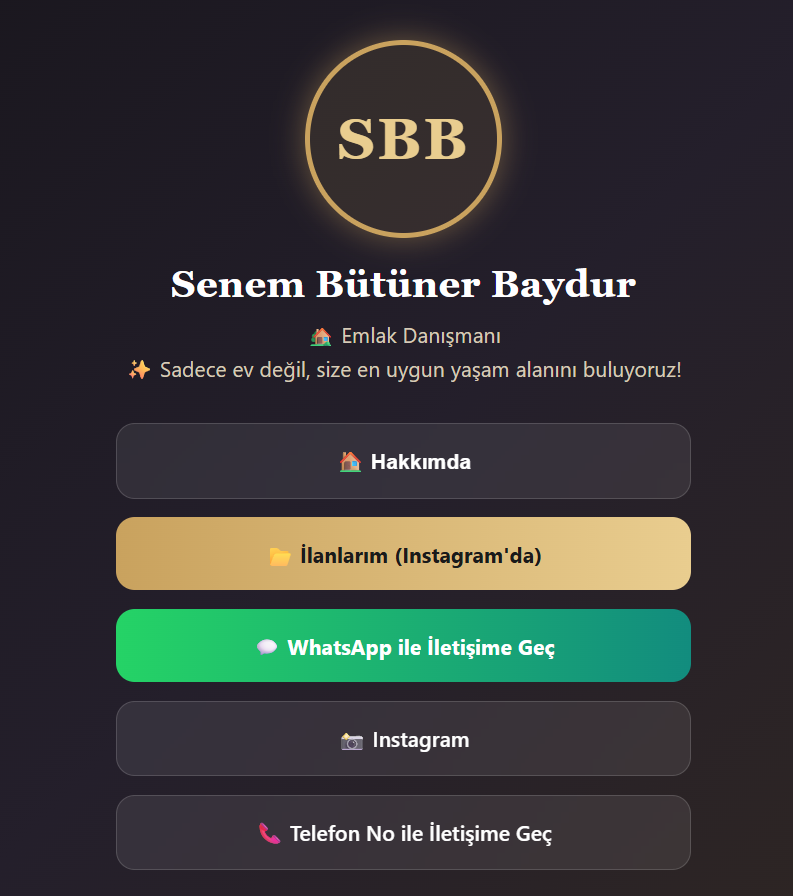
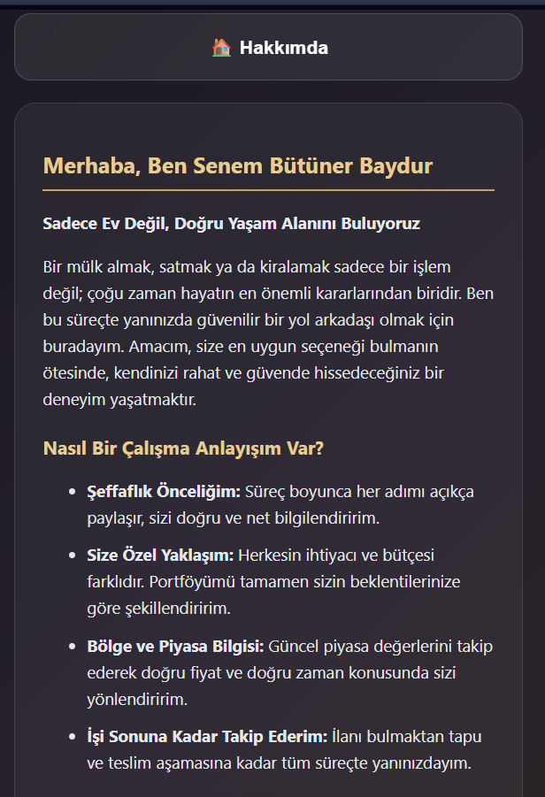

# Senem Bütüner Baydur - Digital Real Estate Business Card 🏡✨

🌐 **Live Site:** [https://senembutunurbayduremlak.netlify.app/](https://senembutunurbayduremlak.netlify.app/)

This project is a modern **Link-in-Bio** profile page designed for clients to access communication channels (WhatsApp, Phone, Instagram) and current real estate listings with a single click.

Reflecting the prestige of the real estate sector with its custom dark theme, it is a fully digital and interactive version of a traditional business card.

## 📸 Page Views

| Main Page View | Expanded "About Me" Section |
| :---: | :---: |
|  |  |

## 🚀 Features

- **Dark & Prestigious Theme:** A premium gold and dark color palette tailored for the real estate industry.
- **Single Page Design:** Fast-loading, lightweight structure built entirely with HTML and CSS.
- **Interactive "About Me" Section:** A JavaScript-powered toggle section that reveals information without navigating away from the page.
- **Quick Contact Buttons:**
  - One-click WhatsApp chat initiation.
  - Direct phone call routing.
  - Quick access to the Instagram profile and current property listings.
- **Fully Responsive:** Flexible flexbox design that adapts flawlessly to all mobile and desktop screens.

## 🛠️ Technologies Used

- **HTML5:** Page skeleton and semantic structure.
- **CSS3:** Styling, gradients, box shadows, and hover animations.
- **Vanilla JavaScript:** Toggle functionality for the "About Me" section.
